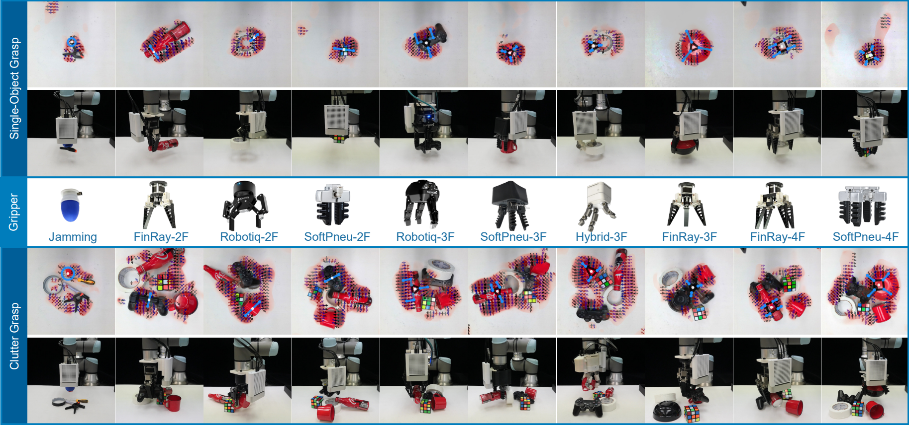

# HybridGen: Learning-Optimization Hybrid Framework for Generalized Grasp Generation

## Transferring Grasping Across Grippers

<p align="center">
  
</p>


HybridGen is a learning-optimization framework for robotic grasping, which adopts antipodal grasp data and generates 2D grasp poses for various grippers (ten tested grippers already available). With the downloaded models, practitioners can deploy this framework to their own grippers with specific kinematics.


<p align="center">
  
</p>

**Videos** : 
[[Youtube](https://www.youtube.com/watch?v=NhV8_Q_E_B4)].


## 1. Prepare environment

Create python environment and install required packages using Conda:
```bash
conda create --name hybridgenEnv python==3.10.4
conda activate hybridgenEnv

pip install -r requirements.txt

# Optimization package CasADi installation
# Details see: optimization/README.md
conda config --add channels conda-forge
conda install casadi
```


## 2. Download Cornell dataset *or* pre-trained models
**Option 1**: Train with dataset

If you want to train the network, please first download the and extract [Cornell Grasping Dataset](http://pr.cs.cornell.edu/grasping/rect_data/data.php). Or you can download the pre-trianed models directly in the next step.

Please find and download the dataset on the Internet, as the original dataset website may fail.

After download the dataset, unzip it to `tipdircnn/dataset/cornell`, execute:
```bash
mkdir dataset && cd dataset && mkdir cornell
# download cornell dataset here
unzip cornell_archive.zip -d cornell/
```
The full path of dataset would be like `tipdircnn/dataset/cornell/01`.

**Option 2**: The pre-trianed models can be downloaded in [Google Drive](https://drive.google.com/drive/folders/1l7kyfeoDR12QuERw6m1_zUzyvFwswZkS?usp=sharing).

Download the pretrained network models and move to `tipdircnn/weights/`.

## 3. Train network
After prepare the dataset, train tipdircnn with the following command:
```bash
# For Example
python tipdircnn/train_network.py --dataset cornell --dataset-path tipdircnn/dataset/cornell/ \
--network efffpn_std --label-type dircen --use-rgb 1 \
--batch-size 16 --tra-batches 500 --epoches 100 \
--val-augment --val-batches 128 --tta-size 4
```
After training, the network weights and log files are stored in `output/`. the weights can be used in the evaluation. 

## 4. Evaluation of tipdirCNN
To show the inference of fingertips, using the dataset images:
(Press any key to continue)
```bash
# Using dirtip, which predict quality with additional network channel.
# details see the paper.
python tipdircnn/eval_network_tta.py --network tipdircnn/weights/efffpn_std/efffpn_dirtip.model \
--dataset cornell --dataset-path tipdircnn/dataset/cornell/ \
--n-grasps 1 --tta-size 4 --iou-eval --label-type dirtip \
--use-rgb 1 --split 0.99 --augment --vis

# Using dircen, which predict quality with variance of Cos/Sin.
python tipdircnn/eval_network_tta.py --network tipdircnn/weights/efffpn_std/efffpn_dircen.model \
--dataset cornell --dataset-path tipdircnn/dataset/cornell/ \
--n-grasps 1 --tta-size 4 --iou-eval --label-type dircen \
--use-rgb 1 --split 0.99 --augment --vis
```

## 5. Optimization with inferred probability maps
In order to easily intergrate our system with other programming languages, we setup a socket-based server for the inference-optimization process in `optimization/grasp_generation_server.py`, which can receive RGBD/Depth images via IP/Port settings, and return the estimated grasp pose for grippers.

To using the inference-optimization hybrid nodes, first start server, which listens to the desired IP:Port indicated in `optimization/modules/param_set.py` (this script stores all settings of the grasp generation, check before use). Then, another client nodes (`optimization/testset_eval_grippertype_client.py` for ten grippers) can connect to the server and send images to the server node. After inferring and generating the grasp pose, the server node returns the grasp pose (position, orientation, and other properties) to the client node. Following gives the detailed steps:

- Step 1: Check the grasp geneartion settiings in `optimization/modules/param_set.py`, including the *IP:Port*, *grippertype*, *network weights*, *TTA Size* and *Input type*, etc.

- Step 2: Run the grasp generation server:
```bash
# Start grasp generation server
# Conda env: conda activate hybridgenEnv
python optimization/grasp_generation_server.py 
```
The server will be in the state of waiting socket connecting.

- Step 3: Start image client node, which retrives the cornell dataset and publishes the image data via socket to the server node:
```bash
# Start image client
# Conda env: conda activate hybridgenEnv
python optimization/testset_eval_grippertype_client.py
```
- Step 4: Server node will conduct inference and optimization (within one mintue), and return the optimization results to the image client. The results are stored at path stated by`result_dir` at `param_set.py`, which is initially set as `tipdircnn/output/`. 

- Note: If you want to implement the system with your specific RGBD cameras, kindly refer to `optimization/testset_eval_grippertype_client.py` and code your own socket nodes. `optimization/sensor_client_demo` gives demo of how to use Microsoft Azure RGBD camera (in ROS) to send a image via socket to grasp pose generation server. 

## Performance
To be added.

## Acknowledgement 
Great thanks to [GGCNN](https://github.com/dougsm/ggcnn), as the code of inference module `tipdircnn` is built upon this project. We implement the fingertip dataset based on its standard Cornell dataset processing.

## Cite
If this project is useful in your research, please cite our prior work: 
> X. Wang and Q. Xu, "Improving Robotic Grasping by Using Object-Gripper Motion Space and Directional Data Ensemble Technique," 2023 IEEE 19th International Conference on Automation Science and Engineering (CASE), Auckland, New Zealand, 2023, pp. 1-6, doi: 10.1109/CASE56687.2023.10260627

More systematic description, evaluation, and discussion of this work are still under release.
